# 2025 Professional Development

Patrick Landy

I completed a section of the [Beginner WordPress Developer](https://learn.wordpress.org/lesson/securely-developing-plugins-and-themes/) course called
[An introduction to the WordPress REST API](https://learn.wordpress.org/lesson/the-wordpress-rest-api/).

My detailed notes from this section are readable in this public markdown file. I made a copy from the private repo where I am working on completing the entire course and making myself a reference guide.

## An introduction to the WordPress REST API

### The Wordpress REST API

https://learn.wordpress.org/lesson/the-wordpress-rest-api/

https://www.youtube.com/watch?v=u04-vaaDS2g

#### What is the WordPress REST API?

THe WordPress REST API provides an interface for applications to interact with a WordPress site. These applications could be WordPress plugins, themes, or custom applications that need to access WordPress site data.

One of the most well-known implementations of the WordPress REST API is the Block Editor, which is a JavaScript application that interacts with WordPress data through the REST API.

If you open your browser's developer tools and look at the Network tab, you can see the requests that are made to the WordPress REST API when you interact with the Block Editor.

#### What does REST API mean?

API stands for Application Programming Interface. It's a set of functionality that allows applications to interact with each other. Wordpress has many APIs, the REST API is just one of them.

REST stands for [Representational State Transfer](https://en.wikipedia.org/wiki/Representational_state_transfer), which is a software architectural style that descrives a uniform interface between physically separate components.

At its core, the WordPress REST API provides REST endpoints (URIs) which represent the posts, pages, taxonomies, and any other custom data types. Your code can send and receive data as JavaScript Object Notation (aka JSON) to these endpoints to fetch, modify, and create content on your site. 

Let's dive into some concepts of the REST API to understand them better. 

#### Routes & Endpoints

In the context of the WordPress REST API, a route is a URI which can be mapped to different HTTP methods.

An HTTP method is the type of request that's made whenever you interact with anything on the web. For example, when you browse to a URL on the web, a GET request is made to the server to request the data. 

When you submit a form, a POST request is made, which passes the submitted form data to the web server. 

The mapping of an individual HTTP method to a route is known as an endpoint.

So you would have for example, a GET endpoint for fetching data, a POST endpoint for creating data, and a DELETE endpoint for deleting data, all using the same route.

#### Local Development Testing

One thing to note about testing REST API routes on a local WordPress installation is that you may need to enable a permalink setting other than "Plain".

This is because the REST API usesthe same URL rewriting functionality as Permalinks to map the human-readable routes and endpoints to the relevant internal request.

So if your local Wordpress installation is using the default Plain permalink setting, change it to something like Post name.

#### Example Routes & Endpoints

Let's look at some examples of routes and endpoints.

If you open a browser and go to the /wp-json/ URI of a WordPress site, you will be making a GET request to that URI, which returns a JSON response. 

Consider a local website I am running on DDEV:

`http://cjdev.ddev.site/wp-json`

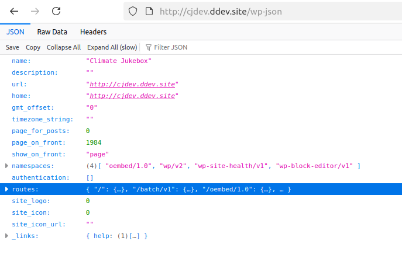

Firefox gives you the option to switch between different views and inspect headers, as shown here.

Depending on your requirements, there are also browser extensions like [JSON Formatter](https://chrome.google.com/webstore/detail/json-formatter/bcjindcccaagfpapjjmafapmmgkkhgoa) for Chrome or [JSON Peep](https://apps.apple.com/us/app/json-peep-for-safari/id1458969831?mt=12) for Safari.

The data returned is a JSON response showing what routes are available and what endpoints are available within each route.

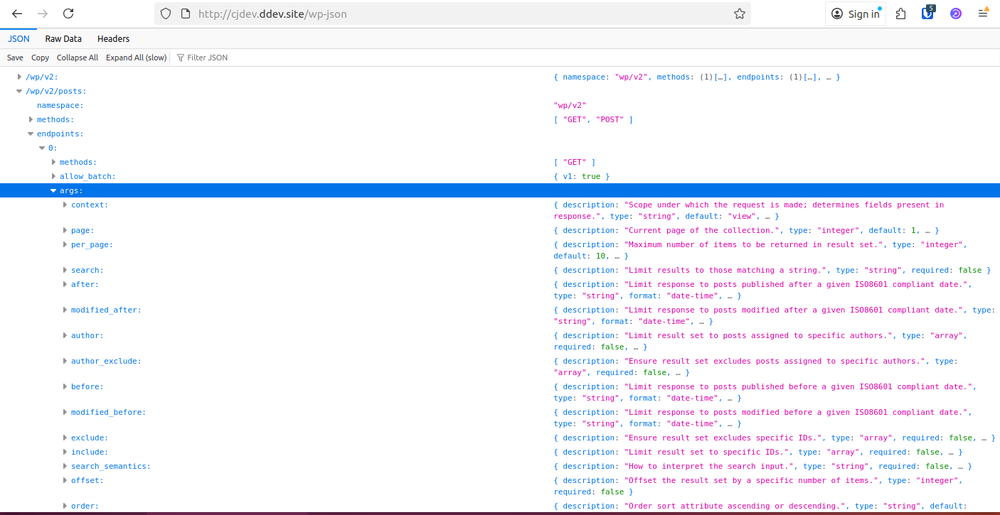

In this example `/wp-json/` is a route, and when that route receives a GET request it's handled by the endpoint which displays the data. This data is what is known as the index for the WordPress REST API.

By contrast, the `/wp-json/wp/v2/posts` route offers a GET endpoint which returns a list of posts, but also a POST endpoint. If you are an authenticated user, and you submit the right data via POST request to the `/wp-json/wp/v2/posts` route, that request is handled by the endpoint which creates new posts.

Typically, the same route (in this case `/wp-json/wp/v2/posts`) will have different endpoints for different HTTP methods, including GET for fetching data, POST for creating data and DELETE for deleting data. 

#### Global Parameters

The WP REST API includes a number of global parameters which control how the API handles the request/response handling. These operate at a layer above the actual resources themselves and are available on all resources. 

Global parameters are implemented on REST API routes as query string parameters. Query strings start with a `?` and are followed by a series of `key=value` pairs, separated by `&`.

Take a look at the `/wp-json/wp/v2/posts` route you looked at earlier, by requesting the route in a browser, thereby activating the GET endpoint. As you can see, the default is to return all available fields for a post.

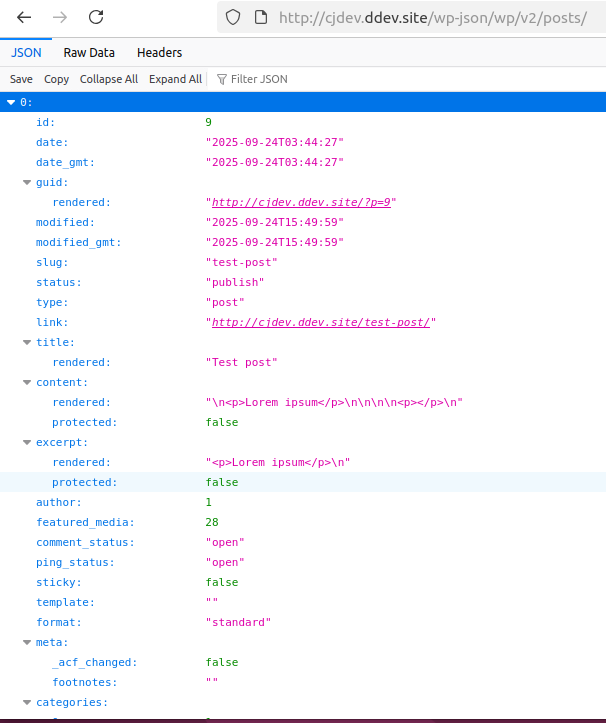

However, you can update the route by adding the _fields global parameter, and then specify the fields you want to return in the response as a comma-delimited list.

`wp-json/wp/v2/posts?_fields=author,id,excerpt,title,link`

If you make a second GET request, by refreshing the browser, only the fields you have requested to be returned in the response are available.

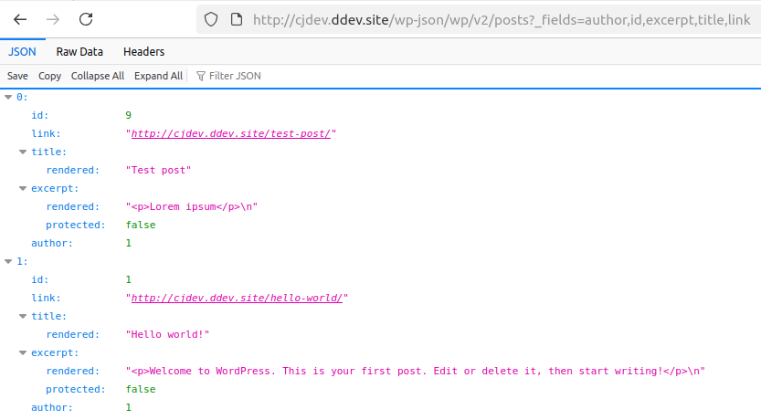

#### Pagination and Ordering

The WP REST API also supports pagination and ordering of results.

Pagination is handled by the per_page, page, and offset parameters.

For example, you can update the `wp-json/wp/v2/posts` route to return only 5 posts per page by adding the `per_page` parameter to the route.

`wp-json/wp/v2/posts?_fields=author,id,excerpt,title,link&per_page=5`

If you make a new GET request by refreshing the page, only the first 5 posts are returned.

It's also possible to order the results, using the `order` and `order_by` parameters.

For example, you can update the `wp-json/wp/v2/posts` route to order by post title, in descending order.

`wp-json/wp/v2/posts?_fields=author,id,excerpt,title,link&per_page=5&orderby=title&order=asc`

Here is what that looks like for my local site with the "topics" post type:

`http://cjdev.ddev.site/wp-json/wp/v2/topics?_fields=author,id,excerpt,title,link&per_page=5&orderby=title&order=asc`

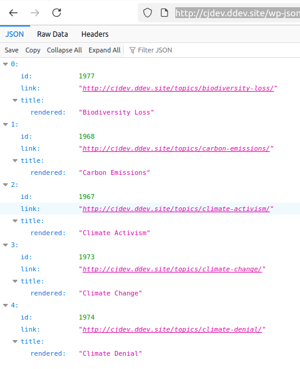

#### Further Reading

The WordPress Developer Resources site has an entire section dedicated to the [REST API](https://developer.wordpress.org/rest-api/) which includes sections on the key REST API concepts, frequently asked questions, using and extending the REST API, and more.

### Using the WordPress REST API

https://learn.wordpress.org/lesson/using-the-wordpress-rest-api/

https://www.youtube.com/watch?v=SdwFRdcAlH0

#### The Bookstore plugin

Revisiting the plugin that registers a custom post type called book.

Code for plugin in this [repo](https://github.com/wptrainingteam/beginner-developer).

Once installed and activated, open main plugin file in code editor.

There is an argument passed to `register_post_type` called `show_in_rest`:

```php
    $args = array(
        'labels'       => array(
            'name'          => 'Books',
            'singular_name' => 'Book',
            'menu_name'     => 'Books',
            'add_new'       => 'Add New Book',
            'add_new_item'  => 'Add New Book',
            'new_item'      => 'New Book',
            'edit_item'     => 'Edit Book',
            'view_item'     => 'View Book',
            'all_items'     => 'All Books',
        ),
        'public'       => true,
        'has_archive'  => true,
        'show_in_rest' => true,
        'supports'     => array( 'title', 'editor', 'author', 'thumbnail', 'excerpt' ),
    );
```

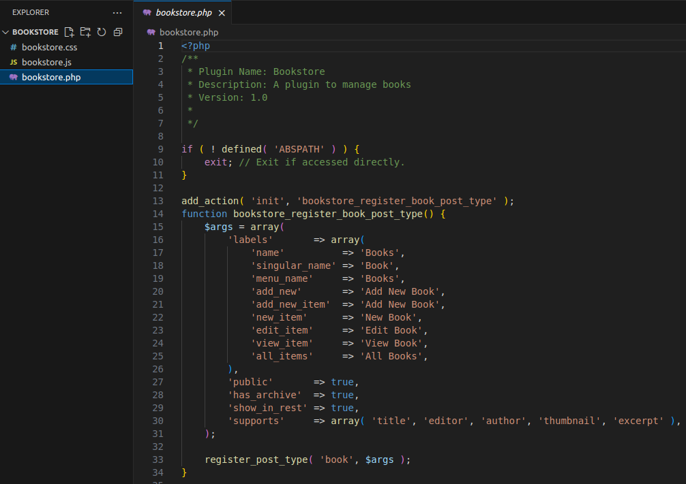

THis argument is set to true, which means that the custom post type is available in the REST API.

This means that if you browse to the `wp-json/wp/v2/book` route, you will see the custom post type data in the response.

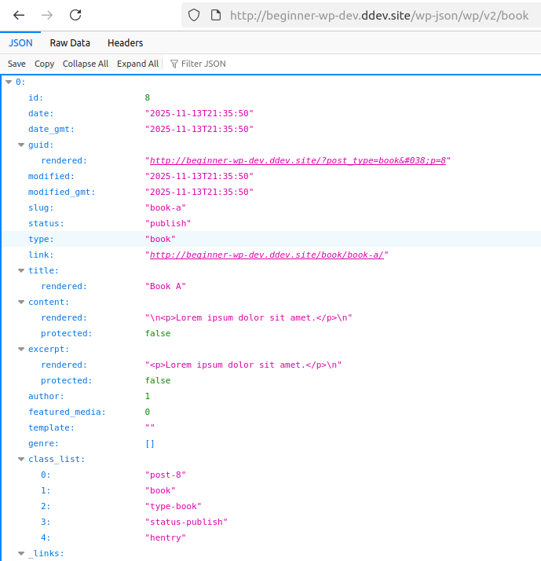

If you take a look at the `register_post_type` [function reference](https://developer.wordpress.org/reference/functions/register_post_type/), you'll see a few additional arguments that can be used to control the REST API response.

For example, you can change the `rest_base` argument to change the route that the custom post type data is available at.

Given that you would expect to be able to fetch more than one book from the book route, it would be a good idea to change the `rest_base` to books.

```php
        'show_in_rest' => true,
        'rest_base'    => 'books',
        'supports'     => array( 'title', 'editor', 'author', 'thumbnail', 'excerpt' ),
```

Now requests can be made to `wp-json/wp/v2/books` to access books via the REST API:

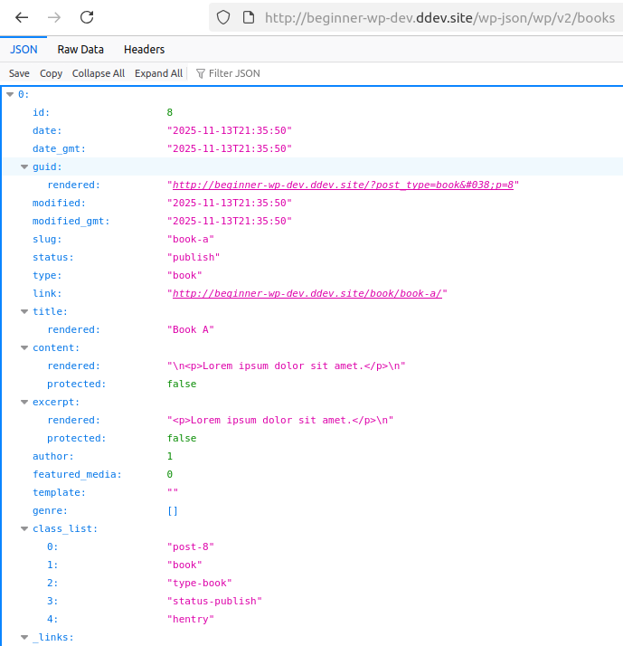

#### Making REST API requests

Let's say you want to add a page in your WordPress dashboard that fetches the books and displays a list of book titles and permalinks in a comma-separated list.

Add an admin submenu to the Books menu using the `admin_menu` hook and the `add_submenu_page` function.

```php
add_action( 'admin_menu', 'bookstore_add_booklist_submenu', 11 );
function bookstore_add_booklist_submenu() {
    add_submenu_page(
        'edit.php?post_type=book',
        'Book List',
        'Book List',
        'edit_posts',
        'book-list',
        'bookstore_render_booklist'
    );
}
```

Then create the `bookstore_render_booklist` callback function to output the HTML for the admin page.

```php
function bookstore_render_booklist() {
    ?>
    <div class="wrap" id="bookstore-booklist-admin">
        <h1>Actions</h1>
        <button id="bookstore-load-books">Load Books</button>
        <h2>Books</h2>
        <textarea id="bookstore-booklist" cols="125" rows="15"></textarea>
    </div>
    <?php
}
```

"Book List" appears as a new submenu page.

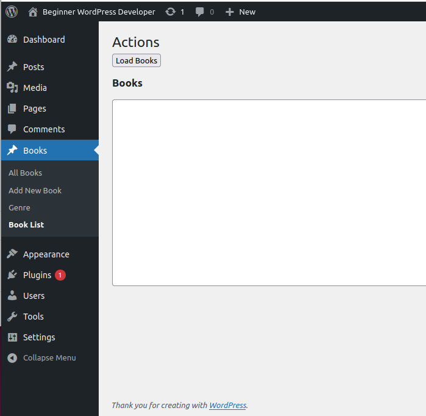

You could add functionality to the `bookstore_render_booklist` function which fetches the book list via PHP and make the button trigger a page refresh. However, for a smoother user experience, you'd like to use JavaScript and the REST API to fetch the book data asynchronously and populate the book list without having to wait for a full page refresh.

#### Enqueueing the admin JavaScript

Load JavaScript in the admin dashboard using the `admin_enqueue_scripts` hook.

Create `admin_bookstore.js` and enqueue:

```php
add_action( 'admin_enqueue_scripts', 'bookstore_admin_enqueue_scripts' );
function bookstore_admin_enqueue_scripts() {
    wp_enqueue_script(
        'bookstore-admin',
        plugins_url() . '/bookstore/admin_bookstore.js',
        array(),
        '1.0.0',
        true
    );
}
```

This code not only enqueues the JS file, but also specifies and empty dependencies array, a version number, and that it should be enqueued in the footer of the HTML page, by setting the last argument to true.

See the [wp_enqueue_script](https://developer.wordpress.org/reference/functions/wp_enqueue_script/) under the parameters section.

#### Option 1: Using the Backbone.js client

Since the REST API was added to WordPress it has included a [Backbone.js](https://backbonejs.org/) [REST API JavaScript Client](https://developer.wordpress.org/rest-api/using-the-rest-api/backbone-javascript-client/) for making direct requests to the WP REST API.

This provides an interface for using the WP REST API by providing Models and Collections for all endpoints exposed through the API.

To ensure that your JS is able to use the REST API client, you need to addit as a dependency to your enqueued JavaScript.

The third argument for `wp_enqueue_script` is an array of any dependencies, and you can add `wp-api` as a dependency to your `wp_enqueue_script` function call.

This will ensure that your plugin's JavaScript code is only loaded after the REST API JavaScript client is loaded, so you can use it in your plugin.

The JS accomplishes the following:

1. Register a click event handler for the new button
2. Then, in the event handler function, you can use the WP API client by accessing it from the global wp object to create a new collection of books, `allBooks`
3. Call the `fetch()` method on `allBooks`
4. Chain the `done()` method to handle the response
5. Loop through the books object and append text to the text area

Final code:

```js
const loadBooksByRestButton = document.getElementById( 'bookstore-load-books' );
if ( loadBooksByRestButton ) {
    loadBooksByRestButton.addEventListener( 'click', function () {
        const allBooks = new wp.api.collections.Books();
        allBooks.fetch().done(
            function ( books ) {
                const textarea = document.getElementById( 'bookstore-booklist' );
                books.forEach( function ( book ) {
                    textarea.value += book.title.rendered + ',' + book.link + ',\n'
                });
            }
        );
    });
}
```

Result (working):

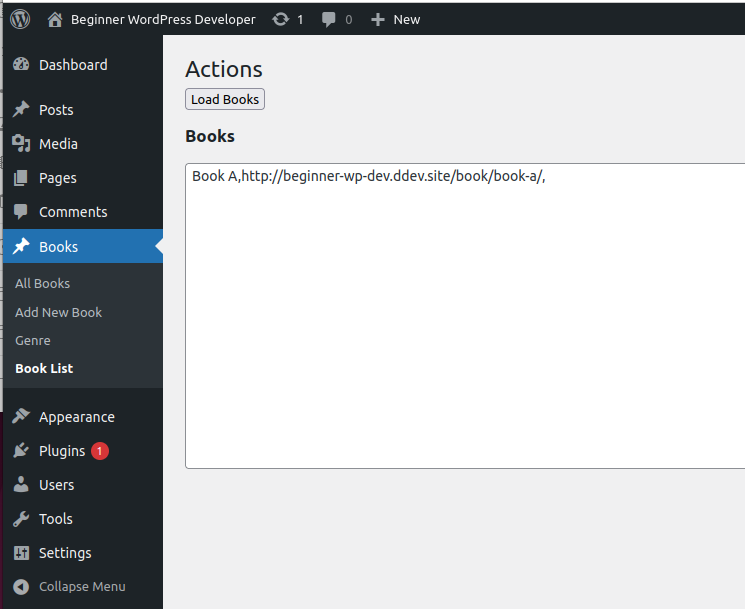

#### Option 2: Using @wordpress/fetch-api

Since the inclusion of the Block Editor in WordPress 5.0, the @wordpress/fetch-api [package](https://developer.wordpress.org/block-editor/reference-guides/packages/packages-api-fetch/) has also been made available to make REST API requests.

This package is a wrapper around the browser fetch [API](https://developer.mozilla.org/en-US/docs/Web/API/Fetch_API), and provides a more modern and flexible way to make requests to the REST API.

To make use of the fetch API you can update your plugin's JavaScript dependencies to include wp-api-fetch.

```js
    wp_enqueue_script(
        'bookstyle-script',
        plugins_url() . '/bookstore/admin_bookstore.js',
        array( 'wp-api', 'wp-api-fetch' ),
        '1.0.0',
        true
    );
```

Add a button to the Actions area of the form to trigger the fetch request.

```php
<button id="bookstore-fetch-books">Fetch Books</button>
```

As before, in your bookstore.js file, set up an event listener on the click event of the new button, but this time use the apiFetch method to make the request to the REST API.

```js
const fetchBooksByRestButton = document.getElementById( 'bookstore-fetch-books' );
if ( fetchBooksByRestButton ) {
    fetchBooksByRestButton.addEventListener( 'click', function () {
        wp.apiFetch( { path: '/wp/v2/books' } ).then( ( books ) => {
            const textarea = document.getElementById( 'bookstore-booklist' );
            books.map( ( book ) => {
                textarea.value += book.title.rendered + ',' + book.link + ',\n'
            });
        } );
    });
}
```

Notice how you pass the the path to the books endpoint in an object to the `wp.apiFetch` function. This is more flexible than using the Backbone.js client, which requires you to use a specific collection to access the books.

You can chain a `then` method to handle the response. This is similar to the use of the `done` method in the Backbone example, in that it returns a promise that waits for the request to the REST API to complete, and then returns the result to the callback function.

Inside the callback function, you can access the books object and loop through it using the map method to append the book title and permalink to the text area.

This also works. Result:

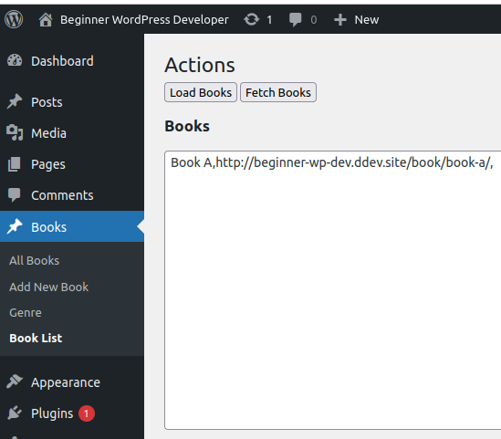

#### Option 3: Using @wordpress/core-data

If you're developing blocks, there is also a `core-data` [package](https://developer.wordpress.org/block-editor/reference-guides/packages/packages-core-data/) available, to access data from the REST API.

`core-data` is meant to simplify access to and manipulation of core WordPress entities. It registers its own store and provides a number of selectors which resolve data from the WordPress REST APU automatically, along with dispatching action creators to manipulate data.

`core-data` makes use of a number of React functionalities, and so is best used in a block context.

Creating a block to demo.

edit.js:
```js
/**
 * Retrieves the translation of text.
 *
 * @see https://developer.wordpress.org/block-editor/reference-guides/packages/packages-i18n/
 */
import { __ } from '@wordpress/i18n';

import { useSelect } from '@wordpress/data';
import { store as bookStore } from '@wordpress/core-data';

/**
 * React hook that is used to mark the block wrapper element.
 * It provides all the necessary props like the class name.
 *
 * @see https://developer.wordpress.org/block-editor/reference-guides/packages/packages-block-editor/#useblockprops
 */
import { useBlockProps } from '@wordpress/block-editor';

/**
 * Lets webpack process CSS, SASS or SCSS files referenced in JavaScript files.
 * Those files can contain any CSS code that gets applied to the editor.
 *
 * @see https://www.npmjs.com/package/@wordpress/scripts#using-css
 */
import './editor.scss';

/**
 * The edit function describes the structure of your block in the context of the
 * editor. This represents what the editor will render when the block is used.
 *
 * @see https://developer.wordpress.org/block-editor/reference-guides/block-api/block-edit-save/#edit
 *
 * @return {Element} Element to render.
 */
export default function Edit() {
	const books = useSelect(
		select =>
			select( bookStore ).getEntityRecords( 'postType', 'book' ),
		[]
    );
	if ( ! books ) {
        return (
            <div { ...useBlockProps() }></div>
        )
    }

    return (
        <div { ...useBlockProps() }>
            { books.map( ( book ) => (
                <p>
                    <a href={ book.link }>{book.title.rendered}</a>
                </p>
            ) ) }
        </div>
    );
}
```

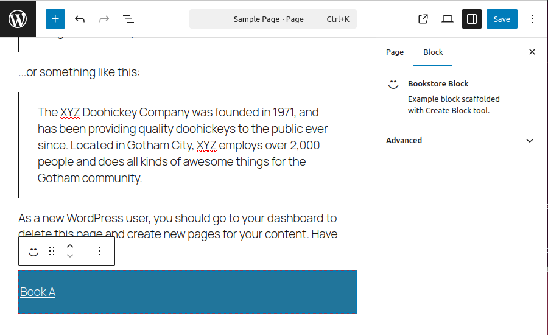

`useSelect` is a hook that allows you to retrieve data from registered selectors.

`useSelect` accepts a callback function as its first argument, where you make use of the `bookStore` store'
s `getEntityRecords` selector to retireve the books from the REST API. Those books are then stored in the books variable.

Then loop through the books object and output title and link.

#### Differences between options

The Backbone client is the oldest of the three options, but it is also the most tightly integrated with the REST API. If you need to build admin dashboard pages using the REST API, it's a good choice, and far better than using the legacy `admin-ajax.php` endpoint.

`apiFetch` is a great all-round solution, because you can use it for admin dashboard pages, as well as blocks in the editor. It's also a more modern way to make requests to the REST API, and is more flexible than the Backbone client.

`core-data` is best used in a block context, as it uses React functionality that is not available outside the context of the block editor.

#### Further Reading

For more information on the various ways you can use the REST API in WordPRess, take a look at the section on the Backbone JavaScript client in the [REST API Handbook](https://developer.wordpress.org/rest-api/using-the-rest-api/backbone-javascript-client/), the `api-fetch` package in the [Block Editor Handbook](https://developer.wordpress.org/block-editor/reference-guides/packages/packages-api-fetch/), and the `core-data` package in the [Block Editor Handbook](https://developer.wordpress.org/block-editor/reference-guides/packages/packages-core-data/).

### Interacting with the WordPress REST API

https://learn.wordpress.org/lesson/interacting-with-the-wordpress-rest-api/

https://www.youtube.com/watch?v=URBsinfSWyk

While the WP REST API is commonly used to fetch data from WordPress, it can also be used to perform other actions.

The REST API also allows you to create, update, and delete various WordPress data types.

To learn in this lesson:
- WP REST API schema
- methods to authenticate a WP REST API request
- tools to test WP REST API requests
- ways to add, edit, delete data via the WP REST API

#### WP REST API Schema

When working with the REST API, it's useful to keep the [Endpoint Reference](https://developer.wordpress.org/rest-api/reference/) section of the WP REST API documentation handy. The Endpoint Reference lists all endpoints that ship with WordPress core.

Clicking on an individual endpoint, say [Posts](https://developer.wordpress.org/rest-api/reference/posts/), will show you the schema for that endpoint. The schema defines all the fields that exist for a resource when fetching or creating data of that specific type.

If you've created a custom post type, like the books custom post type from the bookstore plugin, the schema for the custom post type endpoint will be similar to the posts endpoint. 

You will notice that many of the endpoint fields match up with the fields that are available in the WordPress database table related to that data type. Some, however are slightly different. For example, the title field for the Post endpoint will match up to the `post_title` field in the posts table. It is important to remember that these differences exist and to use the correct field name when interacting with the API.

#### Authentication

By default, the WordPress REST API uses the same cookie-based Authentication method that is used when logging into the WordPress dashboard.

For any REST API endpoints that are not public, or require an authentication user to view or modify, the authentication cookie needs to be present. This is how the block editor works, for example.

There are a number of ways to authenticate requests, including [JSON Web Tokens](https://wordpress.org/plugins/jwt-authentication-for-wp-rest-api/) and [OAuth](https://wordpress.org/plugins/rest-api-oauth1/). 

Another way that's built into WordPress is [Application passwords](https://make.wordpress.org/core/2020/11/05/application-passwords-integration-guide/).

Application passwords can be set on a per-user basis, and are used to authenticate requests to the WP REST API. This allows you to let users access the API without having to share the password they use to log in to the WordPress dashboard.

To create an application password for your user, navigate to your user in the Users list and click on the User to edit it. Scroll down to the bottom of the screen, under the Application Passwords section.

The password will be generated for you. Make sure to copy it and store it somewhere securely, as you won't be able to see it again.

In this screen you are also able to revoke the password, should it ever be leaked.

Using an application password for your user is a great way to test out REST API requests using a REST API testing tool.

If you intend to build something more complex, like a mobile app that connects to a WordPress REST API, you should rather consider using JSON Web Tokens or OAuth 1.0a.

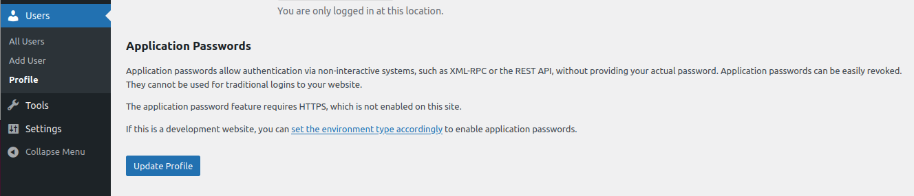

#### Postman

There are a number of tools available to test REST API requests.

For example, if you use PhpStorm, it has a built-in [HTTP client](https://www.jetbrains.com/help/phpstorm/http-client-in-product-code-editor.html), and if you use VSCode, there are extensions like [Postcode](https://marketplace.visualstudio.com/items?itemName=rohinivsenthil.postcode.). There are also standalone tools like [Hoppscotch](https://hoppscotch.io/), and [Postman](https://www.postman.com/). You can even test your REST API endpoints using the [curl command](https://curl.se/) in your terminal.

For the purposes of this lesson, you'll learn how to use Postman to test some REST API requests.

You can download Postman from the [Postman website](https://www.postman.com/downloads/). By default, Postman will create an initial workspace to store your request collections.

Once installed, open Postman and click on the Create Collection button. This will create a new collection, where you can add multiple requests to test.

You can give the collection a name to differentiate it from other collections. Inside the collection click the `Add a Request` button.

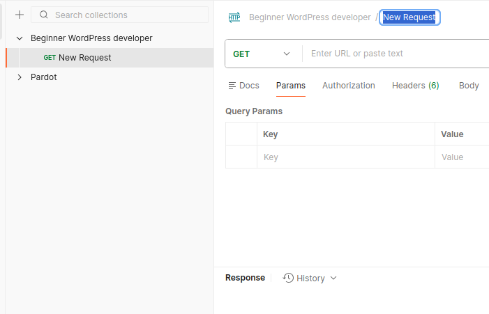

Enter url to local books endpoint and click Send.

The request will be made and the JSON response will be parsed and displayed in the response area.

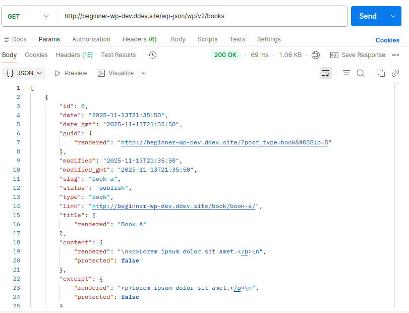

Now, create a new request and enter the same URL to the books endpoint, but this time change the request method to POST and hit send. By changing the request method to POST, you're telling the server that you want to either create or possible update a book.

This time you'll be presented with an error message because you're not authenticated.

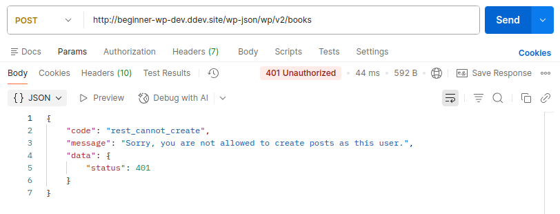

To authenticate the request, click on the Authorization tab and select Basic Auth from the dropdown.

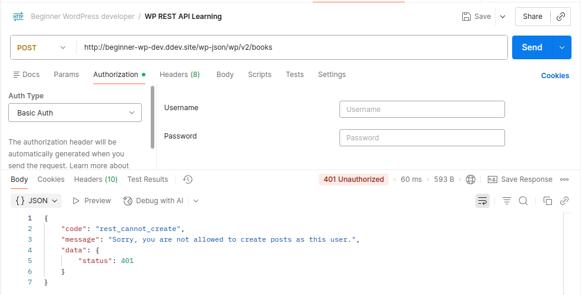

Then enter your username and the Application Password you created earlier and click the Save button.

This time you don't get the same error because you're not authenticated. So you can create books.

Go ahead and create one, by clicking on the Body tab in the request, and selecting the raw radio button. Then, select JSON from the dropdown, and enter the following JSON:

```json
{
    "title": "My Postman Book",
    "content": "This is my Postman book",
    "status": "publish"
}
```

Hit send again, and the book will be created, returning the JSON response of the new book.

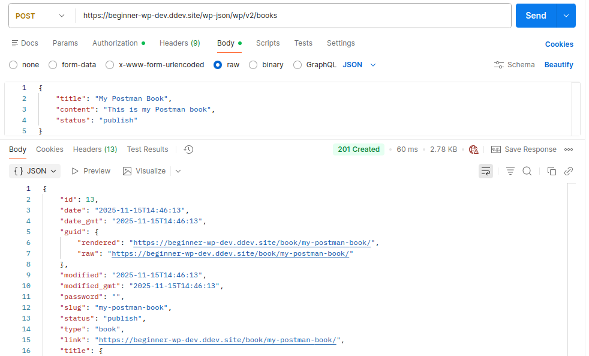

To be sure, go ahead and check the book in the WP dashboard and you should see the book.

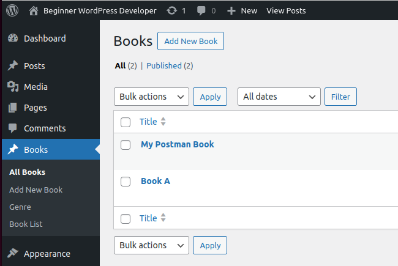

To update a book, you use the same request configuration to add a book, but you change the endpoint URL to include the book ID.

To delet a book, you use the same endpoint URL as updating a book, but you change the request method to DELETE, and don't send any data in the request body.

You'll also notice that deleting a post actually moves it to the trash and doesn't permanently delete it. This matches the behavior of the WordPress dashboard.

Using a tool like Postman to test REST API endpoints is a great way to learn how to use the WP REST API. It's also extremely useful for testing WP REST API requests by ensuring that the data you intend to send is formatted correctly and that the request is being made to the correct endpoint.

#### Creating a Book

Let's use the WP REST API and api-fetch to create a new book.

TO do so, we'll need to pass the title and content fields as a POST request to the books endpoint.

You already have a plugin that allows you to list books, so you can use that as a starting point.

First you'll need to update the page with a form that will allow you to enter the title and content of the book you want to create. You can use the following HTML to create the form and addit to the `bookstore_render_booklist()` admin page callback function, below the existing HTML:

```html
<div style="width:50%;">
    <h2>Add Book</h2>
    <form>
        <div>
            <label for="bookstore-book-title">Book Title</label>
            <input type="text" id="bookstore-book-title" placeholder="Title">
        </div>
        <div>
            <label for="bookstore-book-content">Book Content</label>
            <textarea id="bookstore-book-content" cols="100" rows="10"></textarea>
        </div>
        <div>
            <input type="button" id="bookstore-submit-book" value="Add">
        </div>
    </form>
</div>
```

This HTML code adds a new form to the custom admin page that allows you to enter a title and content for the new book. The form also includes a button to submit the form.

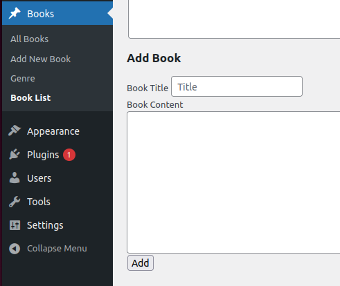

With the form added, the next step would be to add the JavaScript that will handle things when the button is clicked:

```js
const submitBookButton = document.getElementById( 'bookstore-submit-book' );
if ( submitBookButton ) {
    submitBookButton.addEventListener( 'click', function () {
        // create post code
    } );
}
```

Need to do the following:

- Handle the creation of the book (`submitBook` function called on click event)
- update click event handler to call the function
- get the title and content values from the form fields
- request the books endpoint using `api-fetch` by setting the path to the books endpoint, setting the request method to POST and passing the `title` and `content` as a data object

Final working JS:

```js
const submitBookButton = document.getElementById( 'bookstore-submit-book' );
if ( submitBookButton ) {
    submitBookButton.addEventListener( 'click', submitBook );
}

function submitBook() {
    const title = document.getElementById( 'bookstore-book-title' ).value;
    const content = document.getElementById( 'bookstore-book-content' ).value;

    wp.apiFetch( {
        path: '/wp/v2/books/',
        method: 'POST',
        data: {
            title: title,
            content: content
        },
    } ).then( ( result ) => {
        alert( 'Book saved!' );
    } );
}
```

Books can be successfully submitted using the form now with an alert on success. New book is listed as draft.

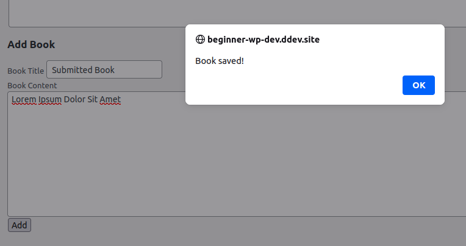

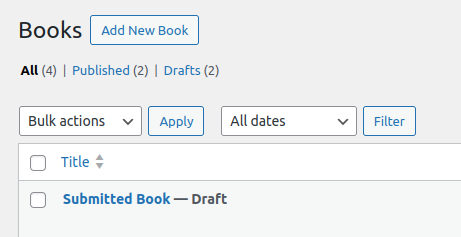

#### Updating and Deleting Books

You can also use the WP REST API to update and delete books.

You can use the same `api-fetch` implementation for updating items as you did for adding items. You need to update the path to include the ID of the data entity being updated (in this case books), so that it updates that item, as well as the updated data object, with the new values for the fields you want to update.

```js
wp.apiFetch( {
    path: '/wp/v2/books/' + id,
    method: 'POST',
    data: {
        title: newTitle,
        content: newContent
    },
} ).then( ( result ) => {
    alert( 'Book Updated!' );
} );
```

Deleting a post only requires the path to be set to the URL of the item, and setting the method to DELETE.

```js
wp.apiFetch( {
    path: '/wp/v2/books/' + id,
    method: 'DELETE',
} ).then( ( result ) => {
    alert( 'Book deleted!' );
} );
```

#### Further Reading

For more information on creating, updating, and deleting data using the WP REST API, check out the [Using the REST API](https://developer.wordpress.org/rest-api/using-the-rest-api/) of the [WP REST API Handbook](https://developer.wordpress.org/rest-api/) as well as the [api-fetch](https://developer.wordpress.org/block-editor/packages/packages-api-fetch/) package reference in the Block Editor Handbook.

### Extending the WordPress REST API

https://learn.wordpress.org/lesson/extending-the-wordpress-rest-api/

https://www.youtube.com/watch?v=vJRHeQIqRV4

The WordPress REST API provides an interface for fetching, adding, updating, and deleting data from a WordPress site in a uniform way.

While the schema for the data types that are available in the REST API is quite extensive, there may be times when you need to store additional data that is not part of the core schema.

In this lesson, you will learn about two methods of adding fields to your REST API requests, either by enabling custom fields in the REST API route, or by making custom fields available as top-level fields.

You'll also learn about the pros and cons to both approaches.

This chapter continues using the [Bookstore plugin](https://github.com/wptrainingteam/beginner-developer/raw/main/bookstore.1.0.2.zip).

#### Important note about modifying responses

Note that modifying WP REST API responses can have unexpected consequences. Changing or removing data from core REST API endpoint responses can break plugins or WordPress core behavior and should be avoided wherever possible.

If you need to retrieve a subset of data from a REST API request, the recommended method is to rather use the [_fields](https://developer.wordpress.org/rest-api/using-the-rest-api/global-parameters/#_fields) global parameter, to limit the fields returned in the response.

For example, you can use the fields parameter to limit the fields returned to just id and title, if those are the only fields you need for your application.

Adding fields to a REST API response is less risky, and so this lesson only covers adding fields.

#### Working with custom fields

Custom fields are also known as metadata and are covered in detail elsewhere.

These fields are often used on custom post types, to store additional pieces of data that are specific to that post type. Under the hood these custom fields are stored in the postmeta table, as a set of key/value pairs attached to the post by the post id.

Beyond Posts, WordPress also supports metadata on other data types, such as comments and users. You can read more about this in the [Metadata API documentation](https://developer.wordpress.org/apis/metadata/).

The WP REST API allows you to create or update custom fields when creating or updating data.

This is possible by passing an object of key/value pairs to the meta property of the post type you're working with.

However, in order to use a custom field, you have to register it first. This is done using the [register_meta function](https://developer.wordpress.org/reference/functions/register_meta/).

#### Registering a custom field

If you wanted to register a custom field called `location` on a post, you would use the `register_meta` function like this:

```php
    register_meta(
        'post',
        'location',
        array(
            'single'       => true,
            'type'         => 'string',
            'default'      => '',
            'show_in_rest' => true,
        )
    );
```

While it's possible to add this anywhere to a plugin, it's recommended to add it to something like the `init` action hook.

```php
add_action( 'init', 'wp_learn_register_meta' );
function wp_learn_register_meta(){
    register_meta(
        'post',
        'location',
        array(
            'single'       => true,
            'type'         => 'string',
            'default'      => '',
            'show_in_rest' => true,
        )
    );
}
```

It's important to ensure that the `show_in_rest` property is set to true, otherwise the custom field will not be available in the REST API.

This will enable the custom field to be added to the REST API schema for a post and will also allow you to post data to the custom field using the REST API. THis is handled by passing the custom field as a key-value pair in the `meta object` of the request body.

```
{
    "title": "New Post Title",
    "content": "New Post Content",
    "status": "publish",
    "meta": {
        "location": "London"
    }
}
```

You can test this by creating a new POST request in Postman and sending the requests to the posts route.

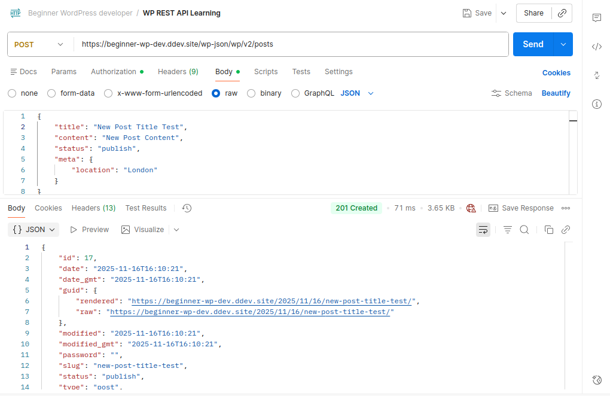

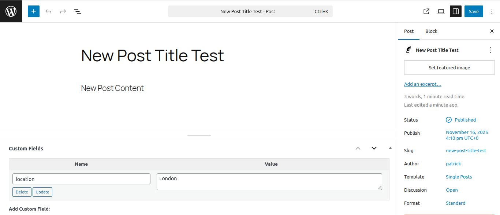

#### Enabling Custom Fields for the specific WP REST API routes

Prior to WordPress 4.9.8, custom fields set to `show_in_rest` using `register_meta` were registered for all objects of a given type. For example, if you added a custom field to the posts type, and then created a custom post type, the custom field would automatically be available in the custom post type.

As of WordPRess 4.9.8, it's possible to use `register_meta` with the `object_subtype` argument that allows one to reduce the usage of the meta key to a particular post type.

Let's say you wanted to register an ISBN custom field only on the book custom post type. You could add this to the code that registers the custom post type, like this:

```php
register_meta(
    'post',
    'isbn',
    array(
        'single'         => true,
        'type'           => 'string',
        'default'        => '',
        'show_in_rest'   => true,
        'object_subtype' => 'book',
    )
);
```

You would now have the `isbn` custom field available only to the book custom post type.

You can test this by adding a book via the REST API.

In Postman, create or update the POST request to the books route and include the `meta` object with the ISBN field:

`/wp-json/wp/v2/book`

Request body:

```
{
    "title": "New Book",
    "content": "New Book Content",
    "status": "publish",
    "meta": {
        "isbn": "978-1-4302-6418-2"
    }
}
```

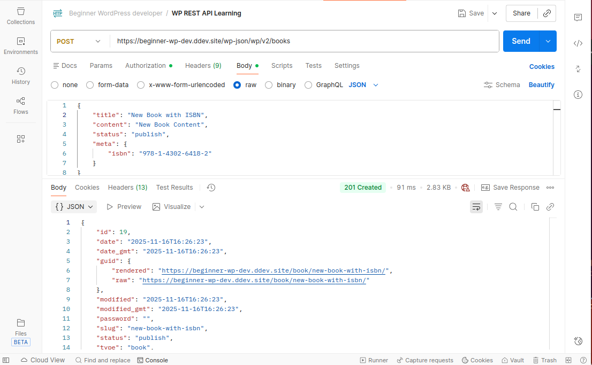

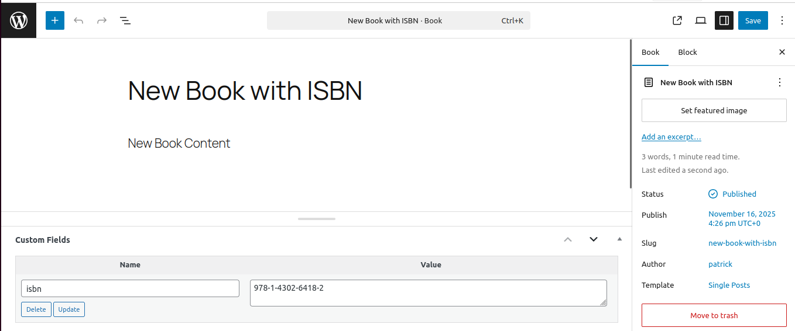

#### Adding Custom Fields as top-level API Responses

The other way to add custom fields to the WP REST API is to add them as top-level fields on the API responses.

In the earlier example, the `isbn` was registered as a meta field and is therefore available in the meta object of the REST API response. But what if you'd prefer to have it as a top-level field, alongside the title, content, and excerpt?

This can be achieved using the [register_rest_field](https://developer.wordpress.org/reference/functions/register_rest_field/) function. Let's look at how this would be implemented.

#### Adding a custom field as a top-level field

Register your rest fields in the `rest_api_init` action hook. This is to ensure that the field is only registered on the REST API.

1. Use `register_rest_field` to register the field. The first parameter is the object type the field should be registered on. This can be a string, for a single object, or an array, for more than one object. Use the book custom post type.
2. The second argument is the name of the field, `isbn`
3. The third parameter is an array of arguments that determines how the field functions. You need to pass at least the following three arguments to the array:
  - `get_callback` - a function that returns the value of a field
  - `update_callback` - a function that updates the value of the field
  - `schema` - an array containing the schema for the field
4. By default an array of the post type's prepared data is passed to the `get_callback` function as the first argument. An implementation of this function could be as straightforward as returning the value of the custom field.
5. The value sent for the field from a REST API create or update request is passed to the `update_callback` function as the first argument, and the model object (ie the post) as the second. An implementation of this function could be as simple as updating the value of the custom field.

```php
    register_rest_field(
        'book',
        'isbn',
        array(
            'get_callback'    => 'bookstore_rest_get_isbn',
            'update_callback' => 'bookstore_rest_update_isbn',
            'schema'          => null,
        )
    );

    function bookstore_rest_get_isbn( $book ){
        return  get_post_meta( $book['id'], 'isbn', true );
    }

    function bookstore_rest_update_isbn( $value, $book ){
        return update_post_meta( $book->ID, 'isbn', $value );
    }
```

If you test this out by creating a new book, and passing a value for the isbn field, you’ll see the data being saved to the database in the post_meta table, but is also displayed as a top-level field in the REST API response.

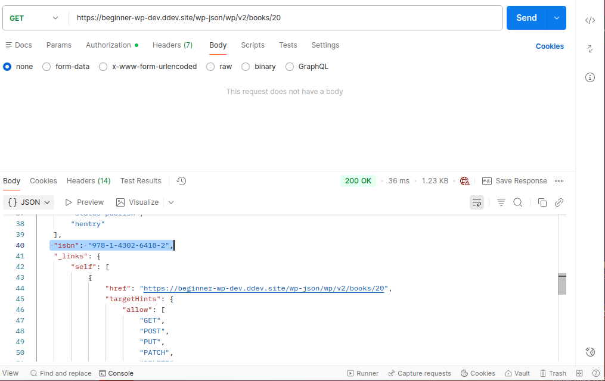

#### Including Schema

The schema argument is an array that describes the schema for the field. While it’s not a requirement, including a schema is encouraged. If nothing else, it helps future developers understand what the field is for. It can also be used to validate the data being sent when creating automated API tests.

```php
    register_rest_field(
        'book',
        'isbn',
        array(
            'get_callback'    => 'wp_learn_rest_get_isbn',
            'update_callback' => 'wp_learn_rest_update_isbn',
            'schema'          => array(
                'description' => __( 'The ISBN of the book' ),
                'type'        => 'string',
            ),
        )
    );
```

You can read more about how to define the schema for REST API resources and fields in the [WP REST API Handbook](https://developer.wordpress.org/rest-api/extending-the-rest-api/schema/).

#### To register_rest_field or not

##### Pros

You do not need to add any further code to enable storing or retrieving data from the custom fields, as long as you remember to fetch and save the data using the meta-object in your application code. You enable the field to show in the REST API, and you can use it straight away. This is also the more performant option, as it does not add any additional code that needs to be executed.

##### Cons

The advantage of using the register_rest_field route is that you can perform additional processing on the data before it is returned, or before it is saved. For example, you could perform some validation on the data before it is saved to the database. You could also add hooks to the get_callback and update_callback functions to either perform additional processing on the data or to allow other developers to extend your custom fields. The downside is that you’re adding a slight overhead to the API requests, as it adds more code that needs to be executed.

#### Further Reading

For more information on modifying REST API responses, check out the [Modifying Responses](https://developer.wordpress.org/rest-api/extending-the-rest-api/modifying-responses) section of the WP REST API Handbook.

### Final version of Bookstore plugin 

Here is the zip file of my code after completing this section of the course.

[Bookstore plugin](./zip-files/bookstore.zip)

[Bookstore block plugin](./zip-files/bookstore-block-to-zip.zip)